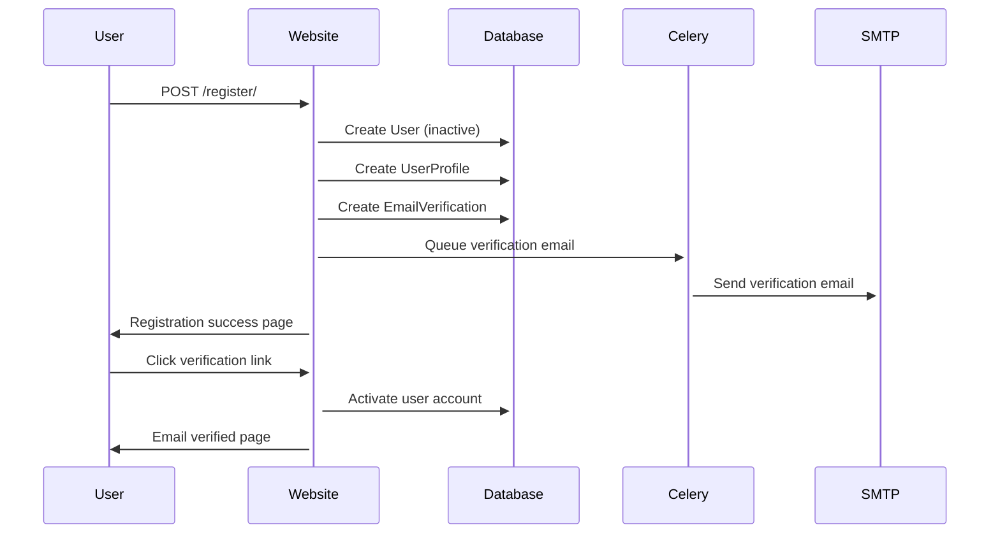
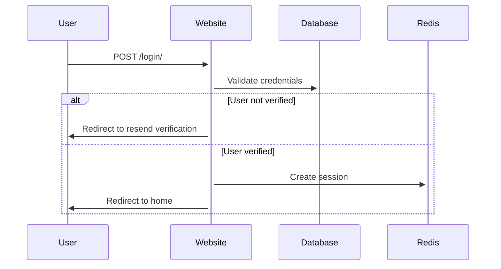
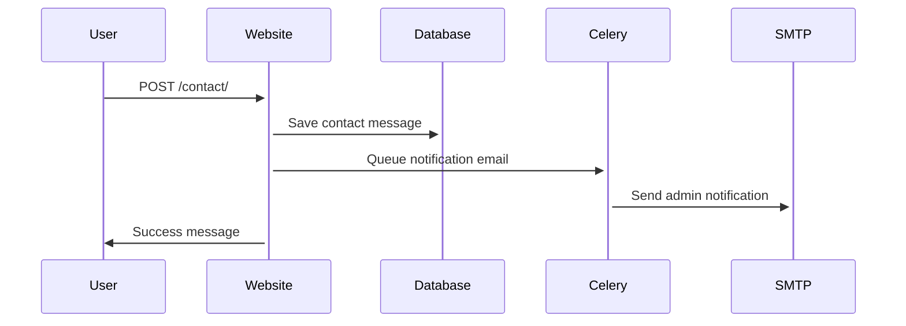
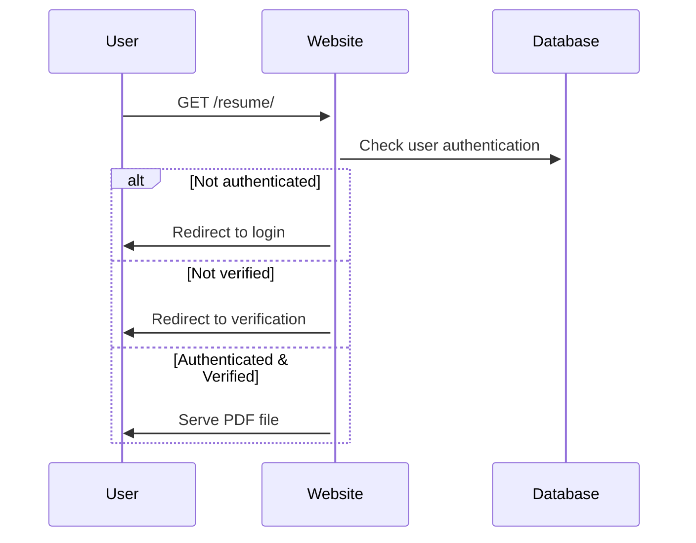

# 🔌 API Documentation - Bethuel Portfolio

## 📋 Overview
This document outlines the internal API endpoints and data flows within the Bethuel Portfolio website.

---

## 🌐 URL Patterns & Endpoints

### Public Endpoints
| Endpoint | Method | Description | Authentication |
|----------|--------|-------------|----------------|
| `/` | GET | Homepage | None |
| `/about/` | GET | About page | None |
| `/projects/` | GET | Projects showcase | None |
| `/experience/` | GET | Work experience | None |
| `/certificate/` | GET | Certifications | None |
| `/contact/` | GET/POST | Contact form | None |

### Authentication Endpoints
| Endpoint | Method | Description | Authentication |
|----------|--------|-------------|----------------|
| `/register/` | GET/POST | User registration | None |
| `/login/` | GET/POST | User login | None |
| `/logout/` | POST | User logout | Required |
| `/password-reset/` | GET/POST | Password reset request | None |
| `/password-reset/done/` | GET | Reset email sent confirmation | None |
| `/reset/<uidb64>/<token>/` | GET/POST | Password reset form | None |
| `/reset/done/` | GET | Password reset complete | None |

### Protected Endpoints
| Endpoint | Method | Description | Authentication |
|----------|--------|-------------|----------------|
| `/resume/` | GET | Resume download | Required + Verified |
| `/resume-page/` | GET | Resume access page | None |

### Email Verification
| Endpoint | Method | Description | Authentication |
|----------|--------|-------------|----------------|
| `/verify-email/<uuid:token>/` | GET | Email verification | None |
| `/resend-verification/` | GET/POST | Resend verification email | None |
| `/registration-success/` | GET | Registration success page | None |

### Admin Endpoints
| Endpoint | Method | Description | Authentication |
|----------|--------|-------------|----------------|
| `/admin/` | GET/POST | Django admin interface | Admin |

---

## 📊 Data Models & Schemas

### User Profile Schema
```json
{
  "user": {
    "id": "integer",
    "username": "string",
    "email": "string",
    "first_name": "string",
    "last_name": "string",
    "is_active": "boolean",
    "date_joined": "datetime"
  },
  "profile": {
    "cell_number": "string (max 20)",
    "address": "string (max 255)"
  }
}
```

### Contact Form Schema
```json
{
  "name": "string (max 100)",
  "email": "email",
  "phone": "string (max 15)",
  "message": "text",
  "submitted_at": "datetime"
}
```

### Email Verification Schema
```json
{
  "user_id": "integer",
  "token": "uuid4",
  "created_at": "datetime",
  "is_verified": "boolean"
}
```

---

## 🔄 API Workflows

### User Registration Flow


### Login Flow


### Contact Form Flow


### Resume Download Flow


---

## 🔧 Celery Tasks API

### Email Tasks
```python
# Send verification email
send_verification_email.delay(user_id, verification_url)

# Send contact form notification
process_contact_form.delay(name, email, phone, message)

# Generic async email
send_email_async.delay(subject, message, from_email, recipient_list)
```

### Task Status Monitoring
```python
# Check task status
from celery.result import AsyncResult
result = AsyncResult(task_id)
status = result.status  # PENDING, SUCCESS, FAILURE, RETRY
```

---

## 🗄️ Database API

### User Operations
```python
# Create user with profile
user = User.objects.create_user(username, email, password)
UserProfile.objects.create(user=user, cell_number=phone, address=addr)

# Verify user
verification = EmailVerification.objects.get(token=token)
verification.is_verified = True
verification.user.is_active = True
```

### Contact Operations
```python
# Save contact form
contact = Contact.objects.create(
    name=name, email=email, phone=phone, message=message
)
```

---

## 🔒 Authentication API

### Session Management
```python
# Login user
from django.contrib.auth import login
login(request, user)

# Check authentication
if request.user.is_authenticated:
    # User is logged in

# Check verification
if hasattr(request.user, 'emailverification'):
    is_verified = request.user.emailverification.is_verified
```

### Decorators
```python
# Require login
@login_required(login_url='/login/')
def protected_view(request):
    pass

# Custom verification check
def verification_required(view_func):
    def wrapper(request, *args, **kwargs):
        if not request.user.emailverification.is_verified:
            return redirect('resend_verification')
        return view_func(request, *args, **kwargs)
    return wrapper
```

---

## 📧 Email API

### SMTP Configuration
```python
EMAIL_BACKEND = 'django.core.mail.backends.smtp.EmailBackend'
EMAIL_HOST = 'smtp.gmail.com'
EMAIL_PORT = 587
EMAIL_USE_TLS = True
EMAIL_HOST_USER = 'your-email@gmail.com'
EMAIL_HOST_PASSWORD = 'your-app-password'
```

### Email Templates
- `password_reset_email.html` - Password reset email
- `password_reset_subject.txt` - Reset email subject
- Console backend for development
- SMTP backend for production

---

## 🚀 Cache API (Redis)

### Session Storage
```python
SESSION_ENGINE = 'django.contrib.sessions.backends.cache'
SESSION_CACHE_ALIAS = 'default'
```

### Cache Operations
```python
from django.core.cache import cache

# Set cache
cache.set('key', 'value', timeout=300)

# Get cache
value = cache.get('key')

# Delete cache
cache.delete('key')
```

---

## 📊 Monitoring APIs

### Health Check Endpoints
```python
# Custom health check
def health_check(request):
    return JsonResponse({
        'status': 'healthy',
        'database': 'connected',
        'redis': 'connected',
        'timestamp': timezone.now()
    })
```

### Service Status
- Database: `pg_isready -U bethuel`
- Redis: `redis-cli ping`
- Celery: Check worker logs
- Nginx: HTTP status codes

---

## 🔧 Configuration API

### Environment Variables
```python
import os
from django.core.management.utils import get_random_secret_key

SECRET_KEY = os.getenv('DJANGO_SECRET_KEY', get_random_secret_key())
DEBUG = os.getenv('DJANGO_DEBUG', 'False') == 'True'
ALLOWED_HOSTS = os.getenv('DJANGO_ALLOWED_HOSTS', '').split(',')
```

### Dynamic Settings
```python
# Database URL parsing
if os.getenv('DATABASE_URL'):
    import dj_database_url
    DATABASES = {'default': dj_database_url.parse(os.getenv('DATABASE_URL'))}
```

---

## 🛠️ Development API

### Management Commands
```bash
# Setup project
python manage.py setup_project

# Create migrations
python manage.py makemigrations

# Apply migrations
python manage.py migrate

# Collect static files
python manage.py collectstatic

# Create superuser
python manage.py createsuperuser
```

### Custom Commands
```python
# Located in resume/management/commands/
class Command(BaseCommand):
    help = 'Custom management command'
    
    def handle(self, *args, **options):
        # Command implementation
        pass
```

---

## 📈 Performance API

### Query Optimization
```python
# Select related for foreign keys
users = User.objects.select_related('userprofile')

# Prefetch for many-to-many
contacts = Contact.objects.prefetch_related('tags')

# Only fetch needed fields
users = User.objects.only('username', 'email')
```

### Caching Strategies
```python
# View caching
from django.views.decorators.cache import cache_page

@cache_page(60 * 15)  # Cache for 15 minutes
def cached_view(request):
    pass

# Template fragment caching


    <!-- Cached content -->

```

---

## 🔍 Error Handling API

### Custom Error Pages
- `404.html` - Page not found
- `500.html` - Server error
- `403.html` - Permission denied

### Exception Handling
```python
try:
    # Risky operation
    pass
except SpecificException as e:
    logger.error(f"Error: {e}")
    messages.error(request, "User-friendly message")
    return redirect('safe_page')
```

---

## 📝 Logging API

### Log Configuration
```python
LOGGING = {
    'version': 1,
    'disable_existing_loggers': False,
    'handlers': {
        'file': {
            'level': 'INFO',
            'class': 'logging.FileHandler',
            'filename': 'django.log',
        },
    },
    'loggers': {
        'django': {
            'handlers': ['file'],
            'level': 'INFO',
            'propagate': True,
        },
    },
}
```

### Usage
```python
import logging
logger = logging.getLogger(__name__)

logger.info("Information message")
logger.warning("Warning message")
logger.error("Error message")
```

---

*API Documentation Version: 1.0.0*
*Last Updated: December 2024*